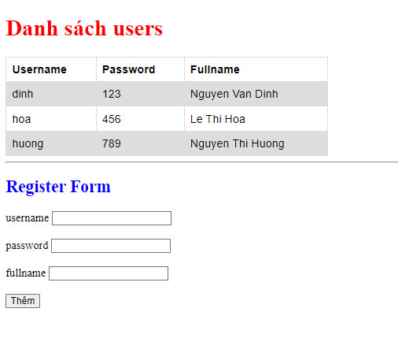

# Chương trình mô phỏng chức năng Đăng ký user

1. Chạy dòng lệnh **npm start** để khởi chạy server (dùng thư viện json-server để mô phỏng dữ liệu trả về từ server)

2.Chạy file index.html bằng **Live Server** để truy cập trang Danh sách users

3. Chọn chức năng Đăng ký ở trang chủ, nhập thông tin username, password và fullname của user muốn đăng ký

- Nếu đăng ký thành công thì chuyển sang trang chủ và hiển thị thông báo:
